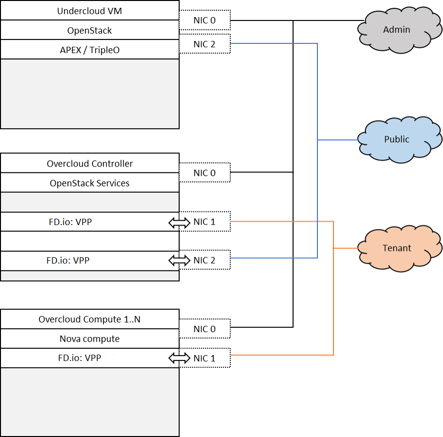

.. OPNFV - Open Platform for Network Function Virtualization
.. This work is licensed under a Creative Commons Attribution 4.0
.. International License.
.. http://creativecommons.org/licenses/by/4.0

Scenario: "OpenStack - FD.io"
=============================

Scenario: os-nosdn-fdio-ha

"os-nosdn-fdio-ha" is a scenario developed as part of the FastDataStacks
OPNFV project. The main components of the "os-nosdn-fdio-ha" scenario
are:

 - APEX (TripleO) installer (please also see APEX installer documentation)
 - Openstack (in HA configuration)
 - FD.io/VPP virtual forwarder for tenant networking
 - networking-vpp (Neutron ML2 mechanism driver for FD.io/VPP)
 - etcd (networking-vpp's distributed key-value store) in clustered mode

Introduction
============

NFV and virtualized high performance applications, such as video processing,
require a "fast data stack" solution that provides both carrier grade
forwarding performance, scalability and open extensibility.

A key component of any NFV solution is the virtual forwarder, which needs to be
a feature rich, high performance, highly scalable virtual switch-router. It needs
to leverage hardware accelerators when available and run in user space.  In
addition, it should be modular and easily extensible. The Vector Packet
Processor (VPP) supplied by the FD.io project meets these needs, in that
it offers a highly scalable, high performance and easily extensible
software forwarder that entirely runs in user space.

The "Openstack - FD.io/VPP" scenario provides the capability to realize a set
of use-cases relevant to the deployment of NFV nodes instantiated by means of
an Openstack orchestration system on FD.io/VPP enabled compute nodes.

A deployment of the "os-nosdn-fdio-ha" scenario consists of 6 or more
servers:

  * 1 Jumphost hosting the APEX installer - running the Undercloud
  * 3 Controlhosts, which run the Overcloud and Openstack services as well as the VPP ML2 etcd cluster
  * 2 or more Computehosts

Tenant networking leverages FD.io/VPP. Open VSwitch (OVS) is used for all other
connectivity, in particular the connectivity to public networking / the
Internet (i.e. br-ext) is performed via OVS as in any standard OpenStack
deployment. Neutron ML2 plugin is configured to use networking-vpp, the ML2-VPP
networking mechanism driver. Networking-vpp also provides the VPP management
agent used to setup and manage layer 2 networking for the scenario. Tenant
networking can either leverage VLANs or plain interfaces. Layer 3 connectivity
for a tenant network is provided centrally via qrouter on the control node. As
in a standard OpenStack deployment, the Layer3 agent configures the qrouter and
associated rulesets for security (security groups) and NAT (floating IPs). Public
IP network connectivity for a tenant network is provided by interconnecting the
VPP-based bridge domain representing the tenant network to qrouter using a tap
interface.

The setup is depicted below:

Features of the scenario
------------------------

Main features of the "os-nosdn-fdio-ha" scenario:

  * Automated installation using the APEX installer
  * Fast and scalable tenant networking using FD.io/VPP as forwarder
  * Layer 2 networking using VLANs, managed and controlled
    through the VPP ML2 plugin
  * Layer 3 connectivitiy for tenant networks supplied centrally
    on the Control node through standard OpenStack mechanisms.
    All layer 3 features apply, including floating IPs (i.e. NAT)
    and security groups
  * DHCP server for tenant instances provided using the standard
    OpenStack dnsmasq server
  * OpenStack high availability
  * etcd (VPP ML2 mechanism driver's distributed key-value store) high availability

Networking in this scenario using VPP
-------------------------------------

The os-nosdn-fdio-ha scenario combines components from two key open
source projects: OpenStack and Fast Data (FD.io).  In order to make Fast Data
(FD.io) networking available to this scenario, an ML2 mechanism driver and a
light-weight control plane agent for VPP forwarder has been created. For
details see also https://github.com/openstack/networking-vpp.

Networking-vpp provides a Neutron ML2 mechanism driver to bring the advantages
of VPP to OpenStack deployments.It uses an etcd cluster on the control node to
keep track of the compute nodes, agent state and port bindings/unbindings.

It's been written to be as simple and readable as possible, which means it's
naive; the aim was not to write the most efficient mechanism driver ever from
right out of the gate, but to write something simple and understandable and see
how well it works and what needs to be changed.

As a general rule, everything was implemented in the simplest way, for two
reasons: one is that one sees working results the quickes, and the other is
that it's much easier to replace a simple system with a more complex one than
it is to change a complex one. The current design will change, but the one
that's there at the moment is small and easy to read, even if it makes you pull
faces when you read it.

Scenario Configuration
======================

To enable the "os-nosdn-fdio-ha" scenario check the appropriate settings
in the APEX configuration files. Those are typically found in /etc/opnfv-apex.

Use the file "os-nosdn-fdio-ha.yaml".

Validated deployment environments
=================================

The "os-nosdn-fdio-ha" scenario has been deployed and tested
on the following sets of hardware:
 * Linux Foundation lab (Chassis: Cisco UCS-B-5108 blade server,
   NICs: 8 external / 32 internal 10GE ports,
   RAM: 32G (4 x 8GB DDR4-2133-MHz RDIMM/PC4-17000/single rank/x4/1.2v),
   CPU: 3.50 GHz E5-2637 v3/135W 4C/15MB Cache/DDR4 2133MHz
   Disk: 1.2 TB 6G SAS 10K rpm SFF  HDD) see also
   https://wiki.opnfv.org/display/pharos/Lflab+Hosting
 * Cisco internal development labs (UCS-B and UCS-C)

Limitations, Issues and Workarounds
===================================

For specific information on limitations and issues, please refer to the APEX
installer release notes.

References
==========

  * FastDataStacks OPNFV project wiki: https://wiki.opnfv.org/display/fds
  * Fast Data (FD.io): https://fd.io/
  * FD.io Vector Packet Processor (VPP): https://wiki.fd.io/view/VPP
  * ML2 VPP mechanism driver: https://github.com/openstack/networking-vpp
  * Networking-vpp launchpad (ticket tracker) https://launchpad.net/networking-vpp
  * Networking-vpp Wiki: https://wiki.openstack.org/wiki/Networking-vpp/
  * APEX (TripleO based) installer: https://wiki.opnfv.org/display/apex/Apex
