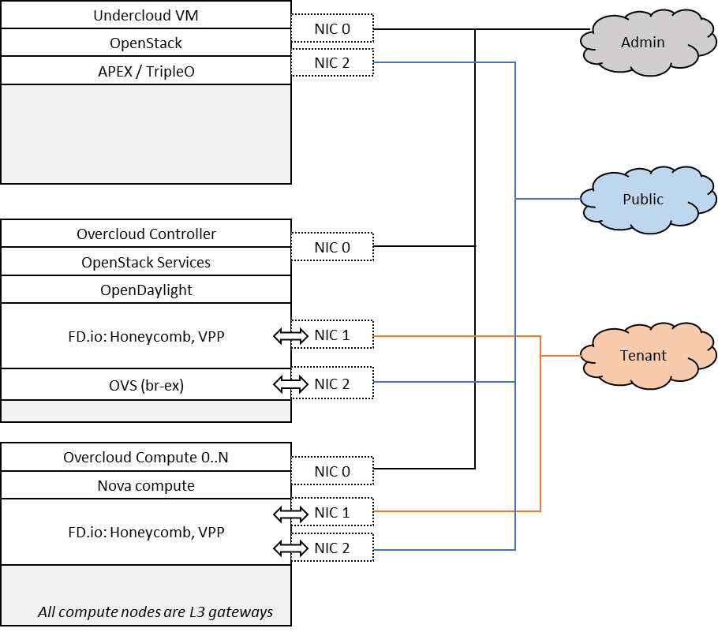
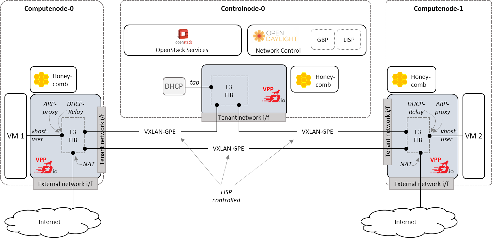
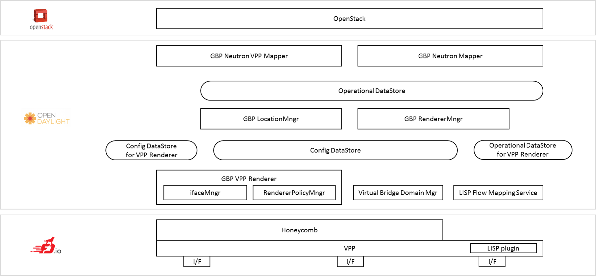
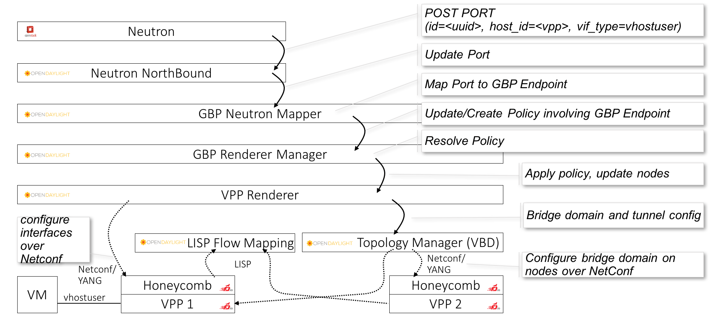

.. OPNFV - Open Platform for Network Function Virtualization
.. This work is licensed under a Creative Commons Attribution 4.0 International License.
.. http://creativecommons.org/licenses/by/4.0

Scenario: "OpenStack - OpenDaylight - FD.io DVR"
======================================================

Scenario: apex-os-odl-fdio-dvr-noha

"apex-os-odl-fdio-dvr-noha" is a scenario developed as part of the
FastDataStacks OPNFV project. The main components of the
"apex-os-odl-fdio-dvr-noha" scenario are:

 - APEX (TripleO) installer (please also see APEX installer documentation)
 - Openstack (in non-HA configuration)
 - OpenDaylight controller (non-clustered) controlling networking
 - FD.io/VPP virtual forwarder for tenant and public networking; the virtual
   forwarder serves as layer 3 forwarder on each compute node, providing high
   availability of layer 3 services

Introduction
============

NFV and virtualized high performance applications, such as video processing,
require a "fast data stack" solution that provides both carrier grade
forwarding performance, scalability and open extensibility, along with
functionality for realizing application policies and controlling a complex
network topology.

A solution stack is only as good as its foundation. Key foundational assets for
NFV infrastructure are

  * The virtual forwarder: The virtual forwarder needs to be a feature rich,
    high performance, highly scale virtual switch-router. It needs to leverage
    hardware accelerators when available and run in user space.
    In addition, it should be modular and easily extensible.
  * Forwarder diversity: A solution stack should support a variety of
    forwarders, hardware forwarders (physical switches and routers)
    as well as software forwarders. This way virtual and physical
    forwarding domains can be seamlessly glued together.
  * Policy driven connectivity: Connectivity should respect and
    reflect different business policies

In order to meet the desired qualities of an NFV infrastructure, the
following components were chosen for the "Openstack - OpenDaylight - FD.io"
scenario:

  * FD.io Vector Packet Processor (VPP) - a highly scalable, high performance,
    extensible virtual forwarder providing fully distributed routing on each
    compute node
  * OpenDaylight Controller - an extensible controller platform which
    offers the ability to separate business logic from networking
    constructs, supports a diverse set of network devices
    (virtual and physical) via the "Group-Based Policy (GBP)"
    component, and can be clustered to achieve a highly available
    deployment.

The "Openstack - OpenDaylight - FD.io DVR" scenario provides the capability to
realize a set of use-cases relevant to the deployment of NFV nodes instantiated
by means of an Openstack orchestration system on FD.io/VPP enabled controller
and compute nodes, with computes nodes being the hosts for distributed virtual
routing. Distributed virtual routing enables all forwarding operations to be
available locally on each compute node, removing scaling issues and performance
bottlenecks. In addition, the forwarding setup is highly available since
a failure on a given compute node is local to that node and doesn't affect
routing anywhere else. The role of the Opendaylight network controller in this
integration is twofold. It provides a network device configuration and topology
abstraction via the Openstack Neutron interface, while providing the capability
to realize more complex network policies by means of Group Based Policies.
Furthermore it also provides the capabilities to monitor as well as visualize
the operation of the virtual network devices and their topologies.
In supporting the general use-case of instantiatiting an NFV instance,
VXLAN GPE overlay encapsulation transport network is used.

A deployment of the "apex-os-odl-fdio-dvr-noha" scenario consists of 4 or more
servers:

  * 1 Jumphost hosting the APEX installer - running the Undercloud
  * 1 Controlhost, which runs the Overcloud as well as
      OpenDaylight as a network controller
  * 2 or more Computehosts. These Computehosts also serve as layer 3 gateways
    for tenant networks and provide ditributed virtual routing

Tenant and public networking leverages FD.io/VPP. On compute nodes,
VPP binds to both the tenant networking interface as well as the public
networking interface. This means that VPP is used for communication within
a tenant network, between tenant networks, as well as between a tenant network
and the Internet.

Note that this setup differs from the usual centralized layer 3 setup with
qrouter on a controller node. There is no layer 2 networking. The OpenDaylight
network controller is used to setup and manage layer 3 networking for the
scenario, with Group Based Policy (GBP) and Locator/Identifier Separation
Protocol (LISP) Flow Mapping Service being the key components. Tenant
networking leverages VXLAN GPE encapsulation, where LISP Flow Mapping Service
and the LISP protocol in VPP create tunnels between nodes where it's required,
providing dynamic, fail-safe connectivity between nodes and obviating the need
for full mesh maintanance and monitoring.

The picture below shows an example setup with two compute and one controller
nodes. Note that the external network is connected via each compute node
through VPP, providing full distributed routing. VPP provides almost all
layer 3 services which are provided in a "vanilla" OpenStack deployment,
including one-to-one NAT but not source NAT, as well as north-south and
east-west traffic filtering for security purposes ("security groups").

Features of the scenario
========================

Main features of the "apex-os-odl-fdio-dvr-noha" scenario:

  * Automated installation using the APEX installer
  * Fast and scalable tenant networking using FD.io/VPP as forwarder
  * Layer 3 tenant networking using VXLAN GPE, managed
    and controlled through OpenDaylight and LISP protocol in FD.io/VPP
  * Layer 3 connectivitiy for tenant networks supplied
    through FD.io/VPP. Layer 3 features, including security groups as well as
    floating IP addresses (i.e. NAT) are implemented by the FD.io/VPP forwarder
  * Manual and automatic (via DHCP relaying) addressing on tenant networks

Scenario components and composition
===================================

The apex-os-odl-fdio-dvr-noha scenario combines components from three key open
source projects: OpenStack, OpenDaylight, and Fast Data (FD.io). The key
components that realize the apex-os-odl-fdio-dvr-noha scenario and which differ
from a regular OVS-based scenario are the OpenStack ML2 OpenDaylight plugin,
OpenDaylight Neutron Northbound, OpenDaylight Group Based Policy, OpenDaylight
Locator/Identifier Separation Protocol Flow Mapping Service,
FD.io Honeycomb management agent and FD.io Vector Packet Processor (VPP).

Here's a more detailed list of the individual software components involved:

**Openstack Neutron ML2 OpenDaylight Plugin**: Handles Neutron data base
synchronization and interaction with the southbound controller using a REST
interface.

**ODL GBP Neutron Mapper**: Maps neutron elements like networks, subnets,
security groups, etc. to GBP entities: Creates policy and configuration for
tenants (endpoints, resolved policies, forwarding rules).

**ODL GBP Neutron VPP Mapper**: Maps Neutron ports to VPP endpoints in GBP.

**ODL GBP Location Manager**: Provides real location for endpoints (i.e. Which
physical node an endpoint is connected to).

**GBP Renderer Manager**: Creates configuration for Renderers (like e.g.
VPP-Renderer or OVS-Renderer). The GBP Renderer Manager is the central point
for dispatching of data to specific device renderers.  It uses the information
derived from the GBP end-point and its topology entries to dispatch the task
of configuration to a specific device renderer by writing a renderer policy
configuration into the registered renderer's policy store. The renderer
manager also monitors, by being a data change listener on the VPP Renderer
Policy States, for any errors in the application of a rendered configuration.

**GBP VPP Renderer Interface Manager**: Listens to VPP endpoints in the
Config DataStore and configures associated interfaces on VPP via HoneyComb.

**LISP Flow Mapping Service**: TODO description

**LISP Plugin**: TODO description

**Virtual Packet Processor (VPP)**: The VPP is the
accelerated data plane forwarding engine relying on vhost user interfaces
towards Virtual Machines created by the Nova Agent.

**VPP LISP**: TODO description

**Honeycomb Netconf server**:
The Honeycomb NETCONF configuration server is responsible for driving
the configuration of the VPP, and collecting operational data.

**Nova Agent**: The Nova Agent, a sub-component of the overall Openstack
architecture, is responsible for interacting with the compute node's host
Libvirt API to drive the life-cycle of Virtual Machines. It, along with the
compute node software, are assumed to be capable of supporting vhost user
interfaces.

The picture below shows the key components.

Neutron Port Callflow
=====================

When a port is created or updated, Neutron sends data to ODL Neutron Northbound
which contain UUID, along with a host-id such as
"overcloud-novacompute-0.opnfv.org" and vif-type as "vhost-user".
The GBP Neutron mapper turns the "Neutron speak" of
"ports" into the generic connectivity model that GroupBasedPolicy uses.
Neutron "ports" become generic "GBP Endpoints" which can be consumed by the
GBP Renderer Manager. The GBP Renderer Manager resolves the policy for the
endpoint, i.e. it determines which communication relationships apply to the
specific endpoint, and hands the resolution to a device specific renderer,
which is the VPP renderer in the given case here. VPP renderer turns the
generic policy into VPP specific configuration. Note that in case the policy
would need to be applied to a different device, e.g. an OpenVSwitch (OVS),
then an "OVS Renderer" would be used. VPP Renderer and LISP Flow Mapping
Service (TODO expand) cooperate to create the actual
network configuration. VPP Renderer configures the interfaces to the virtual
machines (VM), i.e. the vhost-user interface in the given case here and LISP
configured VXLAN tunnels (TODO expand) in the given case here.
VPP Renderer communicated with the device using Netconf/Yang.
All compute and controller nodes run an instance of
VPP and the VPP-configuration agent "Honeycomb". Honeycomb serves as a
Netconf/YANG server, receives the configuration commands from VBD and VPP
Renderer and drives VPP configuration using VPP's local Java APIs.

To provide a better understanding how the above mentioned components interact
with each other, the following diagram shows how the example of creating a
vhost-user port on VPP through Openstack Neutron:

TODO: Add LISP components to diagram

DHCP Packet Flow
================

DHCP traffic from a VM first arrives at vhost-user port in VPP, which is
configured as unnumbered with ip of loopback interface (which corresponds
with tenant interface port) for the VRF where the VM resides.
DHCP proxy is configured to relay DHCP packets to the DHCP server created by
neutron-dhcp-agent running on the node where the VM was created. DHCP relay
sets the destination ip to the ip of the DHCP server and source ip to the
loopback ip. Opendaylight configures a route for the DHCP server, sending
packets to the tap port which is connected to the DHCP namespace.

East-West Packet Flow
=====================

North-South Packet Flow
=======================

TODO: add description (and possibly a picture) of how forwarding works -
    describe how packets travel in the setup
    NOTE: could be in some different place in the document

Scenario Configuration and Deployment
=====================================

The Apex documentation contains information on how to properly setup your
enviroment and how to modify the configuration files.

To deploy the "apex-os-odl-fdio-dvr-noha" scenario, select the
os-odl-fdio-dvr-noha.yaml as your deploy settings and use the
network_settings_vpp.yaml file as template to create a network configuration
file. Both of these are in /etc/opnfv-apex.

The file os-odl-fdio-dvr-noha.yaml mentioned above contains this
configuration::

  deploy_options:
    sdn_controller: opendaylight
    odl_version: oxygen
    odl_routing_node: dvr
    tacker: true
    congress: true
    sfc: false
    vpn: false
    vpp: true
    dataplane: fdio
    performance:
      Controller:
        kernel:
          hugepages: 1024
          hugepagesz: 2M
          intel_iommu: 'on'
          iommu: pt
          isolcpus: 1,2
        vpp:
          main-core: 1
          corelist-workers: 2
          uio-driver: uio_pci_generic
      Compute:
        kernel:
          hugepagesz: 2M
          hugepages: 2048
          intel_iommu: 'on'
          iommu: pt
          isolcpus: 1,2
        vpp:
          main-core: 1
          corelist-workers: 2
          uio-driver: uio_pci_generic

The earliest usable ODL version is Oxygen. "odl_routing_node" with value dvr
chooses the dvr setup and vpp: true and dataplane:fdio together enable vpp
instead of ovs. The perfomance options are vpp specific. The default hugepages
configuration leaves only 3.5GB for VMs (2M * 2048 - 512 for VPP), so if you
wish to have more memory for VMs, either increase the number of hugepages
(hugepages) or the size of each hugepage (hugepagesz) for computes.

In order to create a VM in Openstack you need to use a flavor which uses
hugepages. One way to configure such flavor is this::

  openstack flavor create nfv --property hw:mem_page_size=large

Limitations, Issues and Workarounds
===================================

Source NAT is not supported, meaning a VM without floating ip will not be able
to reach networks outside of Opnestack Cloud (e.g. the Internet). Only
one-to-one NAT is supported (i.e. floating ips).

For other information on limitations and issues, please refer to the APEX
installer release notes.

References
==========

  * FastDataStacks OPNFV project wiki: https://wiki.opnfv.org/display/fds
  * Apex OPNFV project wiki: https://wiki.opnfv.org/display/apex
  * Fast Data (FD.io): https://fd.io/
  * FD.io Vector Packet Processor (VPP): https://wiki.fd.io/view/VPP
  * OpenDaylight Controller: https://www.opendaylight.org/
  * OPNFV Euphrates release - more information: http://www.opnfv.org/euphrates
