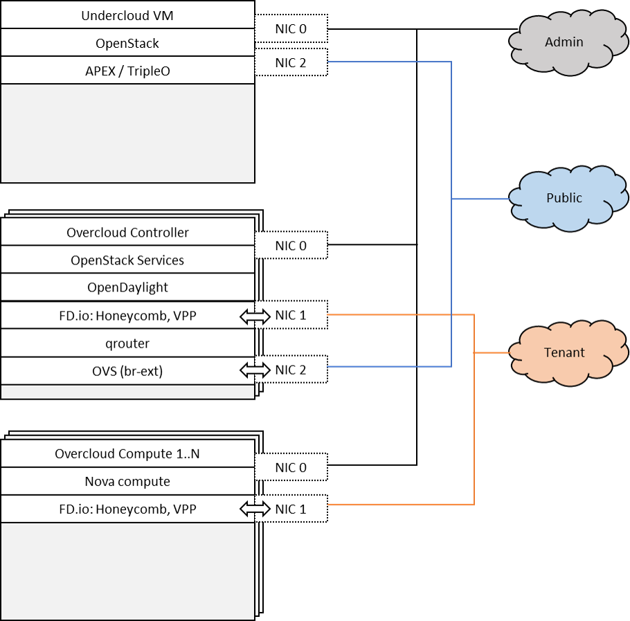
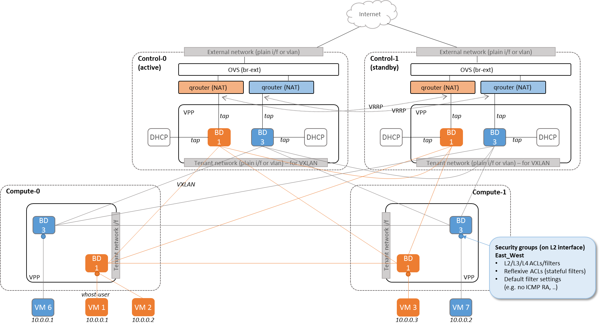
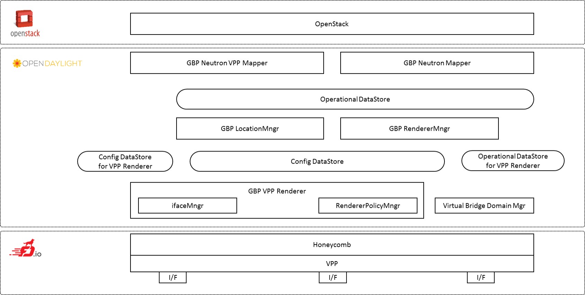
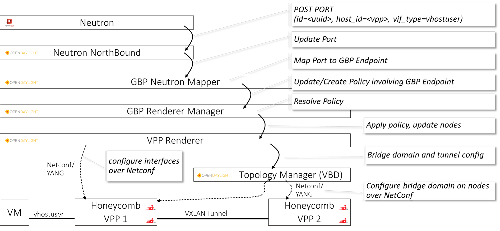

.. OPNFV - Open Platform for Network Function Virtualization
.. This work is licensed under a Creative Commons Attribution 4.0 International License.
.. http://creativecommons.org/licenses/by/4.0

Scenario: "OpenStack - OpenDaylight (Layer 2) - FD.io"
======================================================

Scenario: apex-os-odl_l2-fdio-ha

"apex-os-odl_l2-fdio-ha" is a scenario developed as part of the
FastDataStacks OPNFV project. The main components of the
"apex-os-odl_l2-fdio-ha" scenario are:

 - APEX (TripleO) installer (please also see APEX installer documentation)
 - Openstack (in HA configuration)
 - OpenDaylight controller (non-clustered) controlling layer 2 networking
 - FD.io/VPP virtual forwarder for tenant networking

Introduction
============

NFV and virtualized high performance applications, such as video processing,
require a "fast data stack" solution that provides both carrier grade
forwarding performance, scalability and open extensibility, along with
functionality for realizing application policies and controlling a complex
network topology.

A solution stack is only as good as its foundation. Key foundational assets for
NFV infrastructure are
  * The virtual forwarder: The virtual forwarder needs to be a feature rich,
    high performance, highly scale virtual switch-router. It needs to leverage
    hardware accelerators when available and run in user space.
    In addition, it should be modular and easily extensible.
  * Forwarder diversity: A solution stack should support a variety of
    forwarders, hardware forwarders (physical switches and routers)
    as well as software forwarders. This way virtual and physical
    forwarding domains can be seamlessly glued together.
  * Policy driven connectivity: Connectivity should respect and
    reflect different business

In order to meet the desired qualities of an NFV infrastructure, the
following components were chosen for the "Openstack - OpenDaylight - FD.io"
scenario:
  * FD.io Vector Packet Processor (VPP) - a highly scalable,
    high performance, extensible virtual forwarder
  * OpenDaylight Controller - an extensible controller platform which
    offers the ability to separate business logic from networking
    constructs, supports a diverse set of network devices
    (virtual and physical) via the "group based policy (GBP)"
    component, and can be clustered to achieve a highly available
    deployment.

The "Openstack - OpenDaylight - FD.io" scenario provides the capability to
realize a set of use-cases relevant to the deployment of NFV nodes instantiated
by means of an Openstack orchestration system on FD.io/VPP enabled compute
nodes. The role of the Opendaylight network controller in this integration is
twofold. It provides a network device configuration and topology abstraction
via the Openstack Neutron interface, while providing the capability to realize
more complex network policies by means of Group Based Policies. Furthermore it
also provides the capabilities to monitor as well as visualize the operation of
the virtual network devices and their topologies.
In supporting the general use-case of instantiatiting an NFV instance, two
specific types of network transport use cases are realized:

  * NFV instances with VPP data-plane forwarding using a VLAN provider network
  * NFV instances with VPP data-plane forwarding using a VXLAN overlay
    transport network

A deployment of the "apex-os-odl_l2-fdio-ha" scenario consists of 4 or more
servers:

  * 1 Jumphost hosting the APEX installer - running the Undercloud
  * 3 Controlhosts, which runs the Overcloud as well as OpenDaylight
    as a network controller (OpenDaylight only runs on one Controlhost)
  * 2 or more Computehosts

Tenant networking leverages FD.io/VPP. Open VSwitch (OVS) is used for all other
connectivity, in particular the connectivity to public networking / the
Internet (i.e. br-ext) is performed via OVS as in any standard OpenStack
deployment. The OpenDaylight network controller is used to setup and manage
layer 2 networking for the scenario. Tenant networking can either leverage
VXLAN (in which case a full mesh of VXLAN tunnels is created) or VLANs. Layer 3
connectivity for a tenant network is provided centrally via qrouter on the
control node. As in a standard OpenStack deployment, the Layer3 agent
configures the qrouter and associated rulesets for security (security groups)
and NAT (floating IPs). Public IP network connectivity for a tenant network is
provided by interconnecting the VPP-based bridge domain representing the tenant
network to qrouter using a tap interface. The setup is depicted below:

.. image:: FDS-L3-tenant-connectivity.png

With high availability factored in the setup looks like the following.

Note that the picture only shows two Controllernodes for reasons of
simplicity. A HA deployment will always include 3 Controllernodes.

Features of the scenario
------------------------

Main features of the "apex-os-odl_l2-fdio-ha" scenario:

  * Automated installation using the APEX installer
  * Fast and scalable tenant networking using FD.io/VPP as forwarder
  * Layer 2 networking using VLANs or VXLAN, managed and
    controlled through OpenDaylight
  * Layer 3 connectivitiy for tenant networks supplied centrally on
    the Control node through standard OpenStack mechanisms.
    All layer 3 features apply, including floating IPs (i.e. NAT)
    and security groups.
  * Manual and automatic (via DHCP) addressing on tenant networks
  * OpenStack high availability

Scenario components and composition
===================================

The apex-os-odl_l2-fdio-ha scenario combines components from three key open
source projects: OpenStack, OpenDaylight, and Fast Data (FD.io). The key
components that realize the apex-os-odl_l2-fdio-ha scenario and which differ
from a regular, OVS-based scenario, are the OpenStack ML2 OpenDaylight plugin,
OpenDaylight Neutron Northbound, OpenDaylight Group Based Policy, OpenDaylight
Virtual Bridge Domain Manager, FD.io Honeycomb management agent and FD.io
Vector Packet Processor (VPP).

Here's a more detailed list of the individual software components involved:

**Openstack Neutron ML2 OpenDaylight Plugin**: Handles Neutron data base
synchronization and interaction with the southbound controller using a REST
interface.

**ODL GBP Neutron Mapper**: Maps neutron elements like networks, subnets,
security groups, etc. to GBP entities: Creates policy and configuration for
tenants (endpoints, resolved policies, forwarding rules).

**ODL GBP Neutron VPP Mapper**: Maps Neutron ports to VPP endpoints in GBP.

**ODL GBP Location Manager**: Provides real location for endpoints (i.e. Which
physical node an endpoint is connected to).

**GBP Renderer Manager**: Creates configuration for Renderers (like e.g.
VPP-Renderer or OVS-Renderer). The GBP Renderer Manager is the central point
for dispatching of data to specific device renderers.  It uses the information
derived from the GBP end-point and its topology entries to dispatch the task
of configuration to a specific device renderer by writing a renderer policy
configuration into the registered renderer's policy store. The renderer
manager also monitors, by being a data change listener on the VPP Renderer
Policy States, for any errors in the application of a rendered configuration.

**GBP VPP Renderer Interface Manager**: Listens to VPP endpoints in the
Config DataStore and configures associated interfaces on VPP via HoneyComb.

**GBP VPP Renderer Renderer Policy Manager**: Manages the creation of
bridge domains using VBD and assigns interfaces to bridge domains.

**Virtual Bridge Domain Manager (VBD)**: Creates bridge domains (i.e. in case
of VXLAN creates full mesh of VXLAN tunnels, configures split horizon on
tunnel endpoints etc.). VDB configures VXLAN tunnels always into a full-mesh
with split-horizon group forwarding applied on any domain facing tunnel
interface (i.e. forwarding behavior will be that used for VPLS).

**Virtual Packet Processor (VPP) and Honeycomb server**: The VPP is the
accelerated data plane forwarding engine relying on vhost user interfaces
towards Virtual Machines created by the Nova Agent. The Honeycomb NETCONF
configuration server is responsible for driving the configuration of the VPP,
and collecting the operational data.

**Nova Agent**: The Nova Agent, a sub-component of the overall Openstack
architecture, is responsible for interacting with the compute node's host
Libvirt API to drive the life-cycle of Virtual Machines. It, along with the
compute node software, are assumed to be capable of supporting vhost user
interfaces.

The picture below shows the key components.

To provide a better understanding how the above mentioned components interact
with each other, the following diagram shows how the example of creating a
vhost-user port on VPP through Openstack Neutron:

To create or update a port, Neutron will send a request to ODL Neutron
Northbound which contains the UUID, along with the host-id as "vpp" and
vif-type as "vhost-user". The GBP Neutron mapper turns the "Neutron speak" of
"ports" into the generic connectivity model that GroupBasedPolicy uses.
Neutron "ports" become generic "GBP Endpoints" which can be consumed by the
GBP Renderer Manager. The GBP Renderer Manager resolves the policy for the
endpoint, i.e. it determines which communication relationships apply to the
specific endpoint, and hands the resolution to a device specific renderer,
which is the VPP renderer in the given case here. VPP renderer turns the
generic policy into VPP specific configuration. Note that in case the policy
would need to be applied to a different device, e.g. an OpenVSwitch (OVS),
then an "OVS Renderer" would be used. VPP Renderer and the topology manager
("Virtual Bridge Domain" manager - i.e. VBD) cooperate to create the actual
network configuration. VPP Renderer configures the interfaces to the virtual
machines (VM), i.e. the vhost-user interface in the given case here and
attaches them to a bridge domain on VPP. VBD handles the setup of connectivity
between bridge domains on individual VPPs, i.e. it maintains the VXLAN tunnels
in the given case here. Both VPP Renderer as well as VBD communicate with the
device through Netconf/YANG. All compute and control nodes run an instance of
VPP and the VPP-configuration agent "Honeycomb". Honeycomb serves as a
Netconf/YANG server, receives the configuration commands from VBD and VPP
Renderer and drives VPP configuration using VPP's local Java APIs.

Scenario Configuration
======================

To enable the "apex-os-odl_l2-fdio-ha" scenario check the appropriate
settings in the APEX configuration files. Those are typically found in
/etc/opnfv-apex.

File "deploy_settings.yaml" choose opendaylight as controller with version
"carbon" and enable vpp as forwarder. Also make sure that you set
"ha_enabled" to "true" in the global_params section. "ha_enabled" is the
only real difference from a configuration file perspective between the
scenario with high availability when compared to the ODL-L2 scenario
without high-availability support. "hugepages" need to set to a
sufficiently large value for VPP to work. The default value for VPP is
1024, but this only allows for a few VMs to be started. If feasible,
choose a significantly larger number on the compute nodes::

  global_params:
    ha_enabled: true

  deploy_options:
    sdn_controller: opendaylight
    sdn_l3: false
    odl_version: carbon
    tacker: true
    congress: true
    sfc: false
    vpn: false
    vpp: true
    dataplane: fdio
    performance:
      Controller:
        kernel:
          hugepages: 1024
          hugepagesz: 2M
          intel_iommu: 'on'
          iommu: pt
          isolcpus: 1,2
        vpp:
          main-core: 1
          corelist-workers: 2
          uio-driver: uio_pci_generic
      Compute:
        kernel:
          hugepagesz: 2M
          hugepages: 2048
          intel_iommu: 'on'
          iommu: pt
          isolcpus: 1,2
        vpp:
          main-core: 1
          corelist-workers: 2
          uio-driver: uio_pci_generic

Validated deployment environments
=================================

The "os-odl_l2-fdio-ha" scenario has been deployed and tested
on the following sets of hardware:
 * Linux Foundation lab (Chassis: Cisco UCS-B-5108 blade server,
   NICs: 8 external / 32 internal 10GE ports,
   RAM: 32G (4 x 8GB DDR4-2133-MHz RDIMM/PC4-17000/single rank/x4/1.2v),
   CPU: 3.50 GHz E5-2637 v3/135W 4C/15MB Cache/DDR4 2133MHz
   Disk: 1.2 TB 6G SAS 10K rpm SFF  HDD) see also:
   https://wiki.opnfv.org/display/pharos/Lflab+Hosting
 * OPNFV CENGN lab (https://wiki.opnfv.org/display/pharos/CENGN+Pharos+Lab)
 * Cisco internal development labs (UCS-B and UCS-C)

Limitations, Issues and Workarounds
===================================

For specific information on limitations and issues, please refer to the APEX
installer release notes. Note that this high availability scenario
deploys OpenStack in HA mode *and* OpenDaylight in cluster mode.

References
==========

  * FastDataStacks OPNFV project wiki: https://wiki.opnfv.org/display/fds
  * Fast Data (FD.io): https://fd.io/
  * FD.io Vector Packet Processor (VPP): https://wiki.fd.io/view/VPP
  * OpenDaylight Controller: https://www.opendaylight.org/
  * OPNFV Danube release - more information: http://www.opnfv.org/danube

