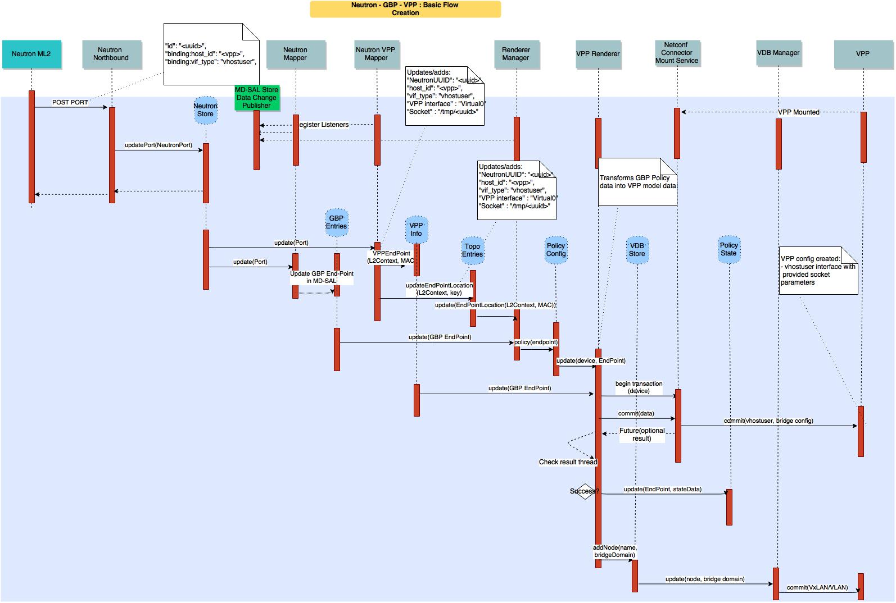

.. OPNFV - Open Platform for Network Function Virtualization
.. This work is licensed under a Creative Commons Attribution 4.0 International License.
.. http://creativecommons.org/licenses/by/4.0

Scenario: "OpenStack - OpenDaylight (Layer 2) - FD.io"
======================================================

Scenario: apex-os-odl_l2-fdio-noha

"apex-os-odl_l2-fdio-noha" is a scenario developed as part of the
FastDataStacks OPNFV project. The main components of the
"apex-os-odl_l2-fdio-noha" scenario are:

 - APEX (TripleO) installer (please also see APEX installer documentation)
 - Openstack (in non-HA configuration)
 - OpenDaylight controller (non-clustered) controlling layer 2 networking
 - FD.io/VPP virtual forwarder for tenant networking

Introduction
============

NFV and virtualized high performance applications, such as video processing,
require a "fast data stack" solution that provides both carrier grade
forwarding performance, scalability and open extensibility, along with
functionality for realizing application policies and controlling a complex
network topology.

A solution stack is only as good as its foundation. Key foundational assets for
NFV infrastructure are
  * The virtual forwarder: The virtual forwarder needs to be a feature rich,
    high performance, highly scale virtual switch-router. It needs to leverage
    hardware accelerators when available and run in user space.
    In addition, it should be modular and easily extensible.
  * Forwarder diversity: A solution stack should support a variety of
    forwarders, hardware forwarders (physical switches and routers)
    as well as software forwarders. This way virtual and physical
    forwarding domains can be seamlessly glued together.
  * Policy driven connectivity: Connectivity should respect and 
    reflect different business

In order to meet the desired qualities of an NFV infrastructure, the 
following components were chosen for the "Openstack - OpenDaylight
 - FD.io/VPP" scenario:
  * FD.io Vector Packet Processor (VPP) - a highly scalable,
    high performance, extensible virtual forwarder
  * OpenDaylight Controller - an extensible controller platform which
    offers the ability to separate business logic from networking
    constructs, supports a diverse set of network devices 
    (virtual and physical) via the "group based policy (GBP)" 
    component, and can be clustered to achieve a highly available
    deployment.

The "Openstack - OpenDaylight - FD.io/VPP" scenario provides the capability to
realize a set of use-cases relevant to the deployment of NFV nodes instantiated
by means of an Openstack orchestration system on FD.io/VPP enabled compute
nodes. The role of the Opendaylight network controller in this integration is
twofold. It provides a network device configuration and topology abstraction
via the Openstack Neutron interface, while providing the capability to realize
more complex network policies by means of Group Based Policies. Furthermore it
also provides the capabilities to monitor as well as visualize the operation of
the virtual network devices and their topologies.
In supporting the general use-case of instantiatiting an NFV instance, two
specific types of network transport use cases are realized:

  * NFV instances with VPP data-plane forwarding using a VLAN provider network
  * NFV instances with VPP data-plane forwarding using a VXLAN overlay
    transport network

A deployment of the "apex-os-odl_l2-fdio-noha" scenario consists of 4 or more
servers:

  * 1 Jumphost hosting the APEX installer - running the Undercloud
  * 1 Controlhost, which runs the Overcloud as well as OpenDaylight
    as a network controller
  * 2 or more Computehosts

.. image:: FDS-ODL_L2-overview.png

Tenant networking leverages FD.io/VPP. Open VSwitch (OVS) is used for all other
connectivity, in particular the connectivity to public networking / the
Internet (i.e. br-ext) is performed via OVS as in any standard OpenStack
deployment. The OpenDaylight network controller is used to setup and manage
layer 2 networking for the scenario. Tenant networking can either leverage
VXLAN (in which case a full mesh of VXLAN tunnels is created) or VLANs. Layer 3
connectivity for a tenant network is provided centrally via qrouter on the
control node. As in a standard OpenStack deployment, the Layer3 agent
configures the qrouter and associated rulesets for security (security groups)
and NAT (floating IPs). Public IP network connectivity for a tenant network is
provided by interconnecting the VPP-based bridge domain representing the tenant
network to qrouter using a tap interface. The setup is depicted below:

.. image:: FDS-L3-tenant-connectivity.png

Features of the scenario
------------------------

Main features of the "apex-os-odl_l2-fdio-noha" scenario:

  * Automated installation using the APEX installer
  * Fast and scalable tenant networking using FD.io/VPP as forwarder
  * Layer 2 networking using VLANs or VXLAN, managed and
    controlled through OpenDaylight
  * Layer 3 connectivitiy for tenant networks supplied centrally on
    the Control node through standard OpenStack mechanisms.
    All layer 3 features apply, including floating IPs (i.e. NAT)
    and security groups.
  * Manual and automatic (via DHCP) addressing on tenant networks

Scenario components and composition
===================================

The apex-os-odl_l2-fdio-noha scenario combines components from three key open
source projects: OpenStack, OpenDaylight, and Fast Data (FD.io). The key
components that realize the apex-os-odl_l2-fdio-noha scenario and which differ
from a regular, OVS-based scenario, are the OpenStack ML2 OpenDaylight plugin,
OpenDaylight Neutron Northbound, OpenDaylight Group Based Policy, OpenDaylight
Virtual Bridge Domain Manager, FD.io Honeycomb management agent and FD.io
Vector Packet Processor (VPP).

Here's a more detailed list of the individual software components involved:

**Openstack Neutron ML2 ODL Plugin**: Handles Neutron data base synchronization
and interaction with the southbound Openstack controller using HTTP.

**OpenDaylight Neutron Nothbound & Neutron MD-SAL Entry Store**: Presents a
Neutron (v2) extended HTTP API servlet for interaction with Openstack Neutron.
It validates and stores the received Neutron data in the MD-SAL data store
against the Neutron yang model driven.

**OpenDaylight Neutron Mapper**: The Neutron Mapper listens to Neutron data
change events and is responsible for using Neutron data in creating Group Based
Policy Data objects, e.g. GBP End-Points, Flood-Domains. A GBP End Point
represents a specific NFV/VM port and its identity as derived from a Neutron
Port. The mapped data is stored using the GBP End Point yang model and an
association between the GBP End-Point and its Neutron object is maintained in
the Neutron-GBP map.

**OpenDaylight Group Based Policy (GBP) Entities store**: Stores for the GBP
data artifacts against the GBP YANG schemas.

**Neutron Group Based Policy Map store**: Stores the bi-lateral relation
between an End-Point and its corresponding Neutron object. Neutron-GBP map;
keyed by Neutron object type, port, and Neutron UUID, gives the GBP End-Point,
Flood domain respectively. GBP-Neutron map keyed by GBP object type, end-point.

**Neutron VPP Renderer Mapper**: The Neutron VPP Renderer Mapper listens to
Neutron Store data change events, as well as being able to access directly the
store, and is responsible for converting Neutron data specifically required to
render a  VPP node configuration with a given End Point, e.g. the virtual host
interface name assigned to a vhostuser socket.. The mapped data is stored in
the VPP info data store.

**VPP Info Store**: Stores VPP specific information regarding End-Points, Flood
domains with VLAN, etc.

**GBP Renderer Manager**: The GBP Renderer Manager is the central point for
dispatching of data to specific device renderers.  It uses the information
derived from the GBP end-point and its topology entries to dispatch the task of
configuration to a specific device renderer by writing a renderer policy
configuration into the registered renderer's policy store. The renderer manager
also monitors, by being a data change listener on the VPP Renderer Policy
States, for any errors in the application of a rendered configuration.

**Renderer Policy Config Store**: The store's schema serves as the API between
the Renderer Manager and specific Renderers like the VPP Renderer. The store
uses a a YANG modeled schema to represent all end-point and associated GBP
policy data.

**Topology Entries Store**: The yang model based MD-SAL topology store serves
two fundamental roles: 1. It maintains a topological representation of the GBP
End Points, in the context of customer networks. 2. It maintains an association
of each (VPP) compute node's physical interfaces to their neutron provider
network (e.g. The association between an ethernet interface and a Neutron
provider network).

**VPP Renderer**: The VPP Renderer registers an instance for VPP nodes with the
Renderer Manager by means of inserting operational data into the Renderer
Policy config store. It acts as a listener on the Renderer Policy consumes via
the GBP Policy API data + the specific VPP End Point data, to drive the
configuration of VPP devices using NETCONF Services.
More specifically, the renderer generates:

  * vhost user port configuration that corresponds to the VM port configuration
  * VPP bridge instances corresponding to the GBP flood domain
  * port or traffic filtering configuration, in accordance with the GBP policy.

The VPP Renderer also interacts with the Virtual Bridge Domain Service, by
means of the VBD store, in order to establish connectivity between VPP nodes in
a bridge domain. For this it uses the VPP device name, and the flood domain
data derived from the VPP Info and End-Point data respectively.  For the
executed configuration operations it updates state in the Renderer policy state
store.

**Virtual Bridge Domain (VBD) Store and Manager**: The virtual bridge domain
manager is responsible for configuring the VxLAN overlay tunnel infrastructure
to arrive at a desired bridged topology between multiple (VPP) compute nodes.
VDB configures VXLAN tunnels always into a full-mesh with split-horizon group
forwarding applied on any domain facing tunnel interface (i.e. forwarding
behavior will be that used for VPLS).

**NETCONF Mount Point Service & Connector**: Collectively referred to as
Netconf Services, provide the NETCONF interface for accessing VPP configuration
and operational data stores that are represented as NETCONF mounts.

**Virtual Packet Processor (VPP) and Honeycomb server**: The VPP is the
accelerated data plane forwarding engine relying on vhost user interfaces
towards Virtual Machines created by the Nova Agent. The Honeycomb NETCONF
configuration server is responsible for driving the configuration of the VPP,
and collecting the operational data.

**Rendered Policy State Store**: Stores data regarding the execution of
operations performed by a given renderer.

**Nova Agent**: The Nova Agent, a sub-component of the overall Openstack
architecture, is responsible for interacting with the compute node's host
Libvirt API to drive the life-cycle of Virtual Machines. It, along with the
compute node software, are assumed to be capable of supporting vhost user
interfaces.

The picture below show a basic end to end call flow for creating a Neutron
vhostuser port on VPP using a GBP renderer. It showcases how the different
component described above interact.

Scenario Configuration
======================

To enable the "apex-os-odl_l2-fdio-noha" scenario check the appropriate
settings in the APEX configuration files. Those are typically found in
/etc/opnfv-apex.

File "deploy_settings.yaml" choose opendaylight as controller with version
"boron" and enable vpp as forwarder::

  global_params:
    ha_enabled: false

  deploy_options:
    sdn_controller: opendaylight
    sdn_l3: false
    odl_version: boron
    tacker: false
    congress: false
    sfc: false
    vpn: false
    vpp: true

Notes and known issues
======================

There are no known issues.

References
==========

  * FastDataStacks OPNFV project wiki: https://wiki.opnfv.org/display/fds
  * Fast Data (FD.io): https://fd.io/
    * FD.io Vector Packet Processor (VPP): https://wiki.fd.io/view/VPP 
  * OpenDaylight Controller: https://www.opendaylight.org/
  * OPNFV Colorado release - more information: http://www.opnfv.org/colorado

