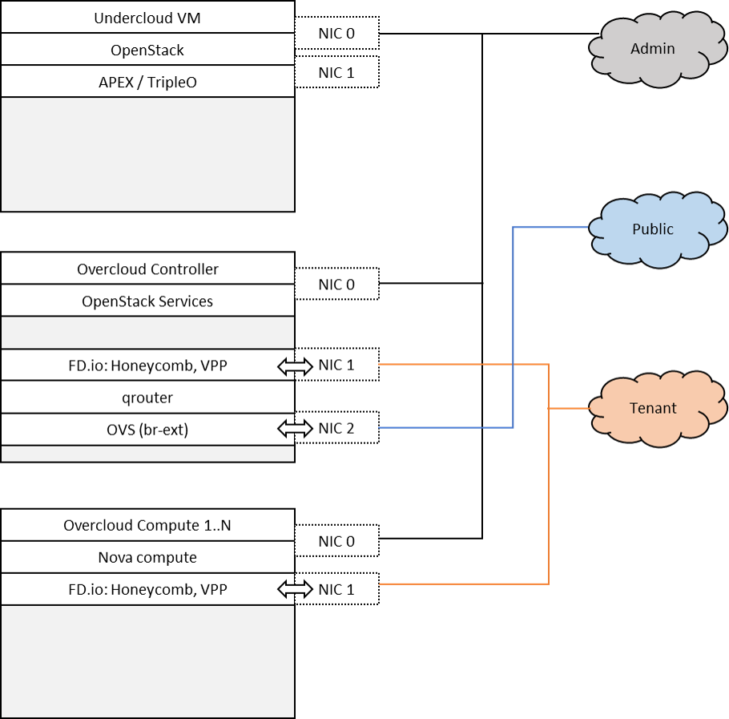

Scenario: "OpenStack - FD.io"
=============================

Scenario: apex-os-nosdn-fdio-noha

"apex-os-nosdn-noha" is a scenario developed as part of the FastDataStacks
OPNFV project. The main components of the "apex-os-nosdn-fdio-noha" scenario
are:

 - APEX (TripleO) installer (please also see APEX installer documentation)
 - Openstack (in non-HA configuration)
 - FD.io/VPP virtual forwarder for tenant networking

Scenario Overview
==================

Basics
------

The "Openstack - FD.io/VPP" scenario provides the capability to realize a set
of use-cases relevant to the deployment of NFV nodes instantiated by means of
an Openstack orchestration system on FD.io/VPP enabled compute nodes.

A deployment of the "apex-os-nosdn-fdio-noha" scenario consists of 3 or more
servers:

  * 1 Jumphost hosting the APEX installer - running the Undercloud
  * 1 Controlhost, which runs the Overcloud and Openstack services
  * 1 or more Computehosts

Tenant networking leverages FD.io/VPP. Open VSwitch (OVS) is used for all other
connectivity, in particular the connectivity to public networking / the
Internet (i.e. br-ext) is performed via OVS as in any standard OpenStack
deployment. A VPP management agent is used to setup and manage layer 2
networking for the scenario. Tenant networking can either leverage VLANs or
plain interfaces. Layer 3 connectivity for a tenant network is provided
centrally via qrouter on the control node. As in a standard OpenStack
deployment, the Layer3 agent configures the qrouter and associated rulesets for
security (security groups) and NAT (floating IPs). Public IP network
connectivity for a tenant network is provided by interconnecting the VPP-based
bridge domain representing the tenant network to qrouter using a tap interface.
The setup is depicted below:

Features of the scenario
------------------------

Main features of the "apex-os-odl_l2-fdio-noha" scenario:

  * Automated installation using the APEX installer
  * Fast and scalable tenant networking using FD.io/VPP as forwarder
  * Layer 2 networking using VLANs, managed and controlled
    through the VPP ML2 plugin
  * Layer 3 connectivitiy for tenant networks supplied centrally
    on the Control node through standard OpenStack mechanisms.
    All layer 3 features apply, including floating IPs (i.e. NAT)
    and security groups.

Networking in this scenario using VPP
-------------------------------------

The apex-os-nosdn-fdio-noha scenario combines components from two key open
source projects: OpenStack and Fast Data (FD.io).  In order to make Fast Data
(FD.io) networking available to this scenario, an ML2 mechanism driver and a
light-weight control plane agent for VPP forwarder has been created. For
details see also
.. _networking-vpp: https://github.com/naveenjoy/networking-vpp/

Networking-vpp provides a Neutron ML2 mechanism driver to bring the advantages
of VPP to OpenStack deployments.

It's been written to be as simple and readable as possible, which means it's
naive; the aim was not to write the most efficient mechanism driver ever from
right out of the gate, but to write something simple and understandable and see
how well it works and what needs to be changed.

As a general rule, everything was implemented in the simplest way, for two
reasons: one is that one sees working results the quickes, and the other is
that it's much easier to replace a simple system with a more complex one than
it is to change a complex one. The current design will change, but the one
that's there at the moment is small and easy to read, even if it makes you pull
faces when you read it.

Scenario Configuration
======================

To enable the "apex-os-nosdn-fdio-noha" scenario check the appropriate settings
in the APEX configuration files. Those are typically found in /etc/opnfv-apex.

File "deploy_settings.yaml" choose opendaylight as controller with version
"boron" and enable vpp as forwarder::

  global_params:
    ha_enabled: false

  deploy_options:
    sdn_controller: false
    sdn_l3: false
    tacker: false
    congress: false
    sfc: false
    vpn: false
    vpp: true

Notes and known issues
======================
